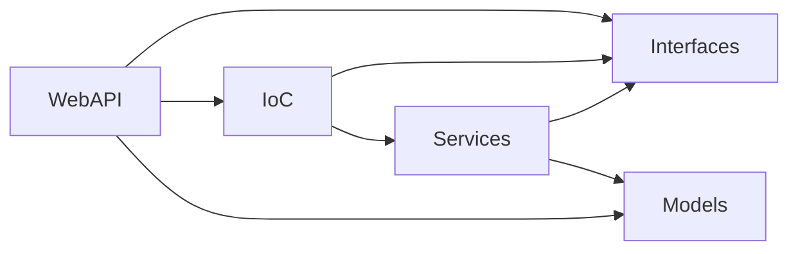

# 🐱‍💻 Desafio Backend 

## ⚙ Como executar
### 🔧 Visual Studio
- Abrir o arquivo [itau-backend-challenge.sln](https://github.com/wsalmi/it-be-challenger/blob/master/itau-backend-challenge.sln)
- Verificar se todos os projetos foram carregados adequadamente
- Executar utilizando suas configurações de launch preferida (IIS Express, Console)

### 🔨 VS Code
- Abrir a pasta do projeto
- Executar o projeto como depuração
	- Essa ação realizará o *restore* e *build* antes de iniciar o debug

### ⌨ CLI
- Abrir a pasta do projeto
- Navegar para a pasta *\itau.backend.challenge* `cd itau.backend.challenge`
- Restaurar os pacotes `dotnet restore`
- Construir a aplicação `dotnet build`
- Executar a aplicação `dotnet run`
- Após esse comando, será exibida a saída abaixo

> PS C:\Users\yourUser\source\git\itau-backend-challenge\itau.backend.challenge> dotnet run
Compilando...
info: Microsoft.Hosting.Lifetime[0]
      Now listening on: https://localhost:5001
info: Microsoft.Hosting.Lifetime[0]
      Now listening on: http://localhost:5000
info: Microsoft.Hosting.Lifetime[0]
      Application started. Press Ctrl+C to shut down.
info: Microsoft.Hosting.Lifetime[0]
      Hosting environment: Development
info: Microsoft.Hosting.Lifetime[0]
      Content root path: C:\Users\yourUser\source\git\itau-backend-challenge\itau.backend.challenge
      
- Após visualizar o bloco acima, acesse um dos endereços reportados acima (ex: https://localhost:5001)
> **❗❗Nota:** Você pode receber uma notificação do navegador referênte ao certificado SSL
> Isso é comum durante o primeiro uso e pode ser resolvido **instalando** o certificado auto-assinado gerado ou ignorando as notificação.

## 🛠 Detalhes da Solução

Optei por construir uma solução .NET Core 3.1 WebAPI.
A mesma segue os princípios SOLID, com exemplos de abstração, acoplamento, extensibilidade e coesao.

Durante a etapa de design, me deparei com questões como:
- Se o objetivo não é persistir dados, faz sentido criar um domínio para essa aplicação?
	- Optei por não implementar um Dominío anêmico, com operações em memória e realizar todas as regras de validações a nível da camada de Application.
- Utilizar ou não o IoC como de costume para alternar o comportamento da aplicação em tempo de execução, mantendo sua base.
	- Optei implementar versionamento de rotas para mostrar a coexistência de comportamentos e optei por utilizar recursos nativos do framework, substituindo factories por method overloads e um model mapper por convert operator (recurso existente no .NET e pouco utilizado).
- Durante construção da camada de apresentação, entrei na questão de como manter métodos com comportamentos anexados, mas mantendo a facilidade de organização e visualização do código, porém sem a necessidade de implementar mais de uma controller a mesma rota e mesmo assim permitir seu versionamento.
	- Optei nesse caso por utilizar um recurso pouco conhecido e explorado que é o Partial Class, que permite dividir a implementação de um mesmo objeto em mais de um arquivo.
	Esse recurso em conjunto com a capacidade de collapse do VS Studio de suas partes, temos uma visualização mais organizada sem a necessidade de pastas e novos namespaces.
- No final do raciocínio, olhando para a complexidade da aplicação e seu tipo de trabalho, optei por utilizar recursos nativos do framework e estratégias de organização da solução, utilizando IoC apenas para recursos que fazem sentido o baixo acoplamento (ex: Services).

### 🖊 Desenho


## Rotas
### POST - /api/v1/Password
#### Request payload
```
{
  "password": "string"
}
```
#### Response payload
```
{
  "isValid": true
}
```
### POST - /api/v2/Password
#### Request payload
```
{
  "password": "string"
}
```
#### Response payload
```
{
  "isValid": true,
  "summary": "string",
  "detail": {
    "hasOneDigit": true,
    "hasUperCase": true,
    "hasLowerCase": true,
    "hasSpecialChar": true,
    "noRepetChar": true
  }
}
```